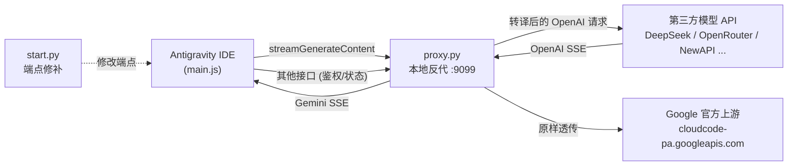

<div align="center">


# Any2Antigravity

**让 Antigravity IDE 无缝接入任意第三方模型** — 把官方 Gemini 协议实时转译为 OpenAI / DeepSeek 兼容协议。

[](https://www.python.org/)
[](https://fastapi.tiangolo.com/)
[](#免责声明--disclaimer)

<p>
  <a href="README.md"><b>简体中文</b></a> ·
  <a href="README_EN.md">English</a>
</p>

</div>

---

## 简介 | Introduction

Any2Antigravity 是一个轻量级 **协议专职网关**。它由两个脚本组成：

| 脚本 | 角色 | 作用 |
| --- | --- | --- |
| [`start.py`](./start.py) | **前置操作** | 一键把 Antigravity IDE 内 `main.js` 的官方端点指向本地代理（并支持一键还原） |
| [`proxy.py`](./proxy.py) | **反代服务** | 拦截 `streamGenerateContent` 请求，实时双向转译 Gemini ⇆ OpenAI 协议 |

- **零侵入**：仅修改 IDE 的端点字符串，自动备份原文件，随时可还原。
- **双向转译**：请求侧 Gemini → OpenAI，响应侧 OpenAI SSE → Gemini SSE。
- **思考链支持**：完整透传 `reasoning_content`（DeepSeek-R1 / Qwen-Thinking 等）。
- **工具调用**：转换 `functionCall` / `functionResponse` 与 `tool_calls`。
- **身份自定义**：一键替换 System / User 消息中的模型名（如 `Gemini 3.6 Flash (High)`）。
- **`.env` 配置**：所有密钥与参数均可通过环境变量覆盖，零依赖（内置 `.env` 解析器）。

> English: Any2Antigravity is a lightweight protocol gateway that lets the Antigravity IDE talk to **any** third-party model. `start.py` patches the IDE endpoints; `proxy.py` live-translates between the Gemini and OpenAI protocols.

---

## 架构 | Architecture



- **命中 `streamGenerateContent`** → 转译为第三方 `POST /chat/completions`。
- **其余所有请求**（鉴权、配额、模型列表…）→ 无损直通 Google 官方。

---

## 目录结构 | Project Layout

```text
ideproxy/
├── proxy.py               # 反代服务（核心网关）
├── start.py               # 前置操作（端点修补 / 还原）
├── requirements.txt       # Python 依赖
├── .env                   # 本地配置（含密钥，勿提交）
├── .env.example           # 配置模板（可提交）
├── antigravity-color.svg  # 项目 Logo
└── packet_dumps/          # 抓包样本（调试用，非必需）
```

---

## 快速开始 | Quick Start

### 1. 安装依赖

```bash
pip install -r requirements.txt
```

### 2. 配置 `.env`

复制模板并按需填写：

```bash
copy .env.example .env
```

```dotenv
# --- 第三方模型配置 ---
TARGET_BASE_URL=https://api.deepseek.com/v1
TARGET_API_KEY=sk-your-key-here
TARGET_MODEL=deepseek-flash

# --- System/User 消息中展示的自定义身份名 ---
LOCAL_MODEL_NAME=Claude Opus 4.8 (Max)

# --- 官方直通上游（一般无需改动）---
OFFICIAL_UPSTREAM=https://cloudcode-pa.googleapis.com

# --- 监听地址与服务端口 ---
HOST=127.0.0.1
PORT=9099
```

### 3. 运行反代服务

```bash
python proxy.py
# 或 uvicorn proxy:app --host 127.0.0.1 --port 9099
```

### 4. 执行前置操作，把 IDE 指向本地代理

```bash
python start.py
```
按提示粘贴 Antigravity IDE 安装目录，然后选择：

| 选项 | 说明 |
| --- | --- |
| `1` | 切换为本地反代 `127.0.0.1:9099`（首次自动备份 `main.js`） |
| `2` | 恢复为 Google 官方端点 |
| `3` | 仅清理后台常驻的 Language Server 守护进程 |

### 5.启动反重力，enjoy

---

## 配置项参考 | Configuration

| 变量 | 默认值 | 说明 |
| --- | --- | --- |
| `TARGET_BASE_URL` | `https://api.deepseek.com/v1` | 第三方 OpenAI 兼容接口基址 |
| `TARGET_API_KEY` | *(空)* | 第三方 API 密钥 |
| `TARGET_MODEL` | `deepseek-flash` | **实际调用**的上游模型 ID |
| `LOCAL_MODEL_NAME` | `Claude Opus 4.8 (Max)` | System/User 消息中**展示**的身份名 |
| `OFFICIAL_UPSTREAM` | `https://cloudcode-pa.googleapis.com` | 官方直通上游 |
| `HOST` | `127.0.0.1` | 反代监听地址 |
| `PORT` | `9099` | 反代监听端口 |

**优先级**：系统环境变量 > `.env` > 代码内默认值。

> [!TIP]
> 临时覆盖无需改文件：
> ```powershell
> $env:TARGET_MODEL="deepseek-reasoner"; python proxy.py
> ```

---

## 工作原理 | How It Works

### 请求侧：Gemini → OpenAI

1. 提取 `systemInstruction` → `system` 消息，并对模型名做**本地化替换**。
2. 遍历 `contents` 每轮，将 `parts` 拆为正文 / 思考链 / 工具调用 / 工具结果。
3. **深度合并**连续相同角色的消息（`user`/`system`/`assistant`），修复 `content` 与 `tool_calls` 双空节点，满足严格校验。
4. 递归清洗工具 Schema 的**大写类型**（`OBJECT` → `object`）。
5. 组装为 `stream: true` 的 OpenAI 请求。

### 响应侧：OpenAI SSE → Gemini SSE

逐块读取上游流，分别转译：

| 上游 delta | 下游 Gemini SSE |
| --- | --- |
| `reasoning_content` | `{ thought: true, text }` |
| `content` | `{ text }` |
| `tool_calls` | `functionCall`（跨帧累积分片后一次性下发） |
| 流结束 | `finishReason: "STOP"` |

### 模型名本地化

System 指令与 User 消息中形如 `{{模型名}} {{版本号}} {{思考强度}}` 的官方标识会被统一替换。

```
输入:  You are Gemini 3.6 Flash (High), a helpful assistant.
输出:  You are Claude Opus 4.8 (Max), a helpful assistant.
```

支持 `Gemini 3.6 Flash (High)`、`Claude 3 Opus (Low)`、`gpt-4o-mini`、`Gemini-2.5-flash`、`o1-preview` 等多种形态；家族词覆盖 gemini / claude / gpt / o1 / qwen / deepseek / glm / grok / mistral / llama。

---

## 故障排查 | Troubleshooting

<details>
<summary><b>IDE 无响应 / 一直转圈</b></summary>

- 确认 `proxy.py` 已启动且端口与 `.env` 中的 `PORT` 一致。
- 查看 `proxy.py` 控制台是否打印 `[ROUTE] 拦截到核心模型调用请求`。
- 检查 `TARGET_API_KEY` 与 `TARGET_BASE_URL` 是否正确。
</details>

<details>
<summary><b>返回「上游模型接口返回错误」</b></summary>

- 网关会把上游的 HTTP 状态码与错误正文回显到 IDE 对话中，按提示排查。
- 常见原因：密钥无效、模型 ID 不存在、余额不足。
</details>

<details>
<summary><b>工具被反复调用</b></summary>

- 多由模型侧工具选择不当引起，可优化工具 `description` 或更换模型。
- 在请求入口打印 `len(openai_req["messages"])` 可确认是否真的重复发请求。
</details>

<details>
<summary><b>想彻底还原 IDE</b></summary>

- 运行 `python start.py` 选择 `2`，会优先用 `.bak` 备份覆盖 `main.js`。
</details>

---

## 免责声明 | Disclaimer

本项目仅供 **学习与研究** 使用。请遵守 Antigravity IDE 及所用第三方服务的服务条款，自行承担使用风险。作者不对任何因使用本工具导致的账号风险、数据丢失或服务中断负责。

---

<div align="center">

<a href="README.md"><b>简体中文</b></a> ·
<a href="README_EN.md">English</a>

Made for the Antigravity community.

</div>
