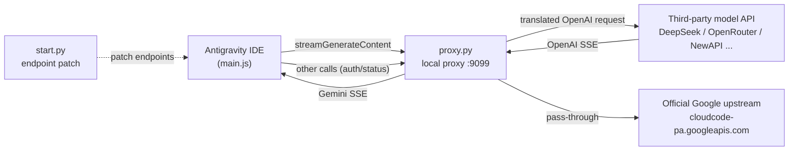

<div align="center">


# Any2Antigravity

**Seamlessly connect the Antigravity IDE to any third-party model** — translating the official Gemini protocol into OpenAI / DeepSeek-compatible calls in real time.

[](https://www.python.org/)
[](https://fastapi.tiangolo.com/)
[](#disclaimer)

<p>
  <a href="README.md">简体中文</a> ·
  <a href="README_EN.md"><b>English</b></a>
</p>

</div>

---

## Introduction

Any2Antigravity is a lightweight **protocol gateway**, composed of two scripts:

| Script | Role | Purpose |
| --- | --- | --- |
| [`start.py`](./start.py) | **Pre-flight** | Points the official endpoints in the IDE's `main.js` to the local proxy (with one-click restore) |
| [`proxy.py`](./proxy.py) | **Reverse proxy** | Intercepts `streamGenerateContent` and bidirectionally translates the Gemini ⇆ OpenAI protocols |

- **Non-invasive**: only edits the endpoint strings in `main.js`, auto-backs-up the original, restorable at any time.
- **Bidirectional translation**: Gemini → OpenAI on the request side, OpenAI SSE → Gemini SSE on the response side.
- **Thinking-chain support**: full pass-through of `reasoning_content` (DeepSeek-R1 / Qwen-Thinking, etc.).
- **Tool calling**: converts `functionCall` / `functionResponse` ⇆ `tool_calls`.
- **Custom identity**: replaces model names in System / User messages (e.g. `Gemini 3.6 Flash (High)`).
- **`.env` configuration**: every key and parameter can be overridden via environment variables, zero dependencies (built-in `.env` parser).

> 中文: Any2Antigravity 是一个轻量级协议网关，让 Antigravity IDE 对接**任意**第三方模型。`start.py` 修补 IDE 端点，`proxy.py` 在 Gemini 与 OpenAI 协议间实时转译。

---

## Architecture



- **Requests matching `streamGenerateContent`** → translated to a third-party `POST /chat/completions`.
- **All other requests** (auth, quota, model list…) → passed through to Google untouched.

---

## Project Layout

```text
ideproxy/
├── proxy.py               # Reverse proxy (the core gateway)
├── start.py               # Pre-flight (endpoint patch / restore)
├── requirements.txt       # Python dependencies
├── .env                   # Local config (contains secrets, do not commit)
├── .env.example           # Config template (safe to commit)
├── antigravity-color.svg  # Project logo
└── packet_dumps/          # Captured samples (debug only, optional)
```

---

## Quick Start

### 1. Install dependencies

```bash
pip install -r requirements.txt
```

### 2. Configure `.env`

Copy the template and fill it in:

```bash
copy .env.example .env
```

```dotenv
# --- Third-party model config ---
TARGET_BASE_URL=https://api.deepseek.com/v1
TARGET_API_KEY=sk-your-key-here
TARGET_MODEL=deepseek-flash

# --- Custom identity shown in System/User messages ---
LOCAL_MODEL_NAME=Claude Opus 4.8 (Max)

# --- Official pass-through upstream (usually unchanged) ---
OFFICIAL_UPSTREAM=https://cloudcode-pa.googleapis.com

# --- Bind address and port ---
HOST=127.0.0.1
PORT=9099
```

### 3. Start the reverse proxy

```bash
python proxy.py
# or: uvicorn proxy:app --host 127.0.0.1 --port 9099
```

### 4. Run the pre-flight step to point the IDE at the local proxy

```bash
python start.py
```

Paste your Antigravity IDE install directory when prompted, then choose:

| Option | Description |
| --- | --- |
| `1` | Switch to the local proxy `127.0.0.1:9099` (auto-backs-up `main.js` on first run) |
| `2` | Restore the official Google endpoints |
| `3` | Only kill the background Language Server daemon |

> [!IMPORTANT]
> Do not reverse the order: **start `proxy.py` first, then run `start.py`**. The patch restarts the Language Server to take effect.

---

## Configuration

| Variable | Default | Description |
| --- | --- | --- |
| `TARGET_BASE_URL` | `https://api.deepseek.com/v1` | Third-party OpenAI-compatible base URL |
| `TARGET_API_KEY` | *(empty)* | Third-party API key |
| `TARGET_MODEL` | `deepseek-flash` | The upstream model ID **actually called** |
| `LOCAL_MODEL_NAME` | `Claude Opus 4.8 (Max)` | The identity name **displayed** in System/User messages |
| `OFFICIAL_UPSTREAM` | `https://cloudcode-pa.googleapis.com` | Official pass-through upstream |
| `HOST` | `127.0.0.1` | Proxy bind address |
| `PORT` | `9099` | Proxy bind port |

**Priority**: system environment variable > `.env` > in-code default.

> [!TIP]
> Override temporarily without editing files:
> ```powershell
> $env:TARGET_MODEL="deepseek-reasoner"; python proxy.py
> ```

---

## How It Works

### Request side: Gemini → OpenAI

1. Extract `systemInstruction` into a `system` message and **localize the model name**.
2. Walk each `contents` turn, splitting `parts` into text / thinking / tool-call / tool-result.
3. **Deep-merge** consecutive same-role messages (`user`/`system`/`assistant`) and repair nodes with both empty `content` and `tool_calls` to satisfy strict validation.
4. Recursively sanitize **uppercase tool-schema types** (`OBJECT` → `object`).
5. Assemble into an OpenAI request with `stream: true`.

### Response side: OpenAI SSE → Gemini SSE

Read the upstream stream chunk by chunk and translate each piece:

| Upstream delta | Downstream Gemini SSE |
| --- | --- |
| `reasoning_content` | `{ thought: true, text }` |
| `content` | `{ text }` |
| `tool_calls` | `functionCall` (arguments accumulated across frames, emitted once) |
| stream end | `finishReason: "STOP"` |

### Model-name localization

Official identifiers shaped like `{{name}} {{version}} {{thinking-strength}}` in the System instruction and User messages are replaced uniformly.

```
input:  You are Gemini 3.6 Flash (High), a helpful assistant.
output: You are Claude Opus 4.8 (Max), a helpful assistant.
```

Supports forms such as `Gemini 3.6 Flash (High)`, `Claude 3 Opus (Low)`, `gpt-4o-mini`, `Gemini-2.5-flash`, `o1-preview`; family words cover gemini / claude / gpt / o1 / qwen / deepseek / glm / grok / mistral / llama.

---

## Troubleshooting

<details>
<summary><b>IDE hangs / keeps spinning</b></summary>

- Make sure `proxy.py` is running and its port matches `PORT` in `.env`.
- Check whether `proxy.py` prints `[ROUTE] 拦截到核心模型调用请求` in its console.
- Verify `TARGET_API_KEY` and `TARGET_BASE_URL`.
</details>

<details>
<summary><b>"Upstream model API returned an error"</b></summary>

- The gateway echoes the upstream HTTP status and error body into the IDE chat — follow its hint.
- Common causes: invalid key, non-existent model ID, insufficient balance.
</details>

<details>
<summary><b>A tool is called repeatedly</b></summary>

- Usually caused by poor tool selection on the model side; refine the tool `description` or switch models.
- Print `len(openai_req["messages"])` at the request entry to confirm whether requests are actually duplicated.
</details>

<details>
<summary><b>Fully restore the IDE</b></summary>

- Run `python start.py` and choose `2`; it prefers restoring `main.js` from the `.bak` backup.
</details>

---

## Disclaimer

This project is for **educational and research purposes only**. Please comply with the Terms of Service of Antigravity IDE and any third-party providers you connect to. Use at your own risk. The author is not liable for any account risk, data loss, or service interruption caused by using this tool.

---

<div align="center">

<a href="README.md">简体中文</a> ·
<a href="README_EN.md"><b>English</b></a>

Made for the Antigravity community.

</div>
